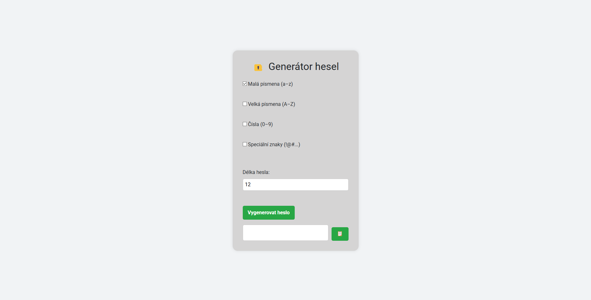

# 🔐 Generátor hesel

Jednoduchá webová aplikace pro generování bezpečných náhodných hesel podle zvolených kritérií.

## ✨ Funkce

- Výběr, co má heslo obsahovat:
  - ✅ Malá písmena (a–z)
  - ✅ Velká písmena (A–Z)
  - ✅ Čísla (0–9)
  - ✅ Speciální znaky (!@#$...)
- Nastavení délky hesla (od 4 do 30 znaků)
- Okamžité vygenerování hesla na 1 klik
- Tlačítko pro zkopírování hesla do schránky
- Moderní čistý vzhled (vlastní CSS + Google font)

## 🌐 Online verze

Vyzkoušej aplikaci zde:  
➡️ [https://hanacektomas.github.io/password_gen](https://hanacektomas.github.io/password_gen)

## 📸 Náhled

## 🛠️ Technologie

- HTML, CSS, JavaScript
- Google Fonts (Roboto)
- Hostováno zdarma přes GitHub Pages

## 📁 Struktura souborů

